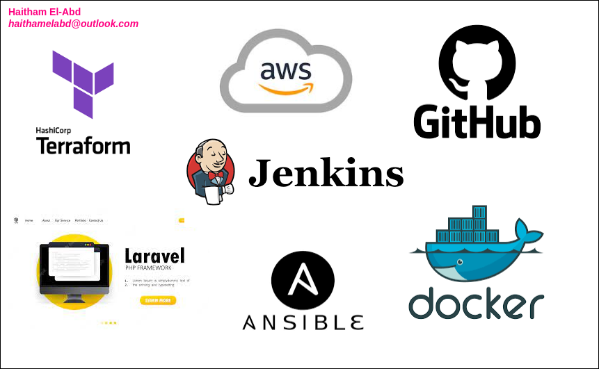

# Laravel Deployment with Jenkins Pipeline



This repository provides a Jenkins pipeline for deploying Laravel (PHP | Apache | Mysql) Applications. The pipeline automates the build, test, and deployment processes, using Docker, Docker Compose, Ansible, and MySQL as the database engine. It also includes a container for phpMyAdmin to manipulate data. The infrastructure required to host the Application can be provisioned using Terraform an Infrastructure as Code (IAC) tool. Terraform allows you to define and manage your infrastructure resources in a declarative manner.

## Technology Used

The deployment pipeline for Laravel applications utilizes the following technologies:

- **Terraform**: Infrastructure As a Tool which allows you to define and manage your infrastructure resources in a declarative manner.
- **Docker**: A containerization platform that allows applications to be packaged into containers for consistent deployment across different environments.
- **Docker Compose**: A tool for defining and managing multi-container Docker applications.
- **Ansible**: A configuration management and orchestration tool that automates the setup and configuration of servers and applications.
- **Jenkins**: An open-source automation server that orchestrates the entire deployment process.
- **MySQL**: A popular open-source relational database management system used as the database engine for the Laravel application.
- **phpMyAdmin**: A web-based tool for managing MySQL databases.

## Usage
 
To deploy the Laravel application with the Jenkins pipeline, follow these steps:

1. Push Changes to your project repository

2. Create EC2 instance with security group 

   ```bash 
    cd Terraform
    terraform init
    terraform plan
    terraforl apply -auto-approve
   ```

3. Transfer script to remote machine with `scp` command or any other way such as connect to machine and open new vim file and copy and past the `Tools-Installation-Script.sh` content in it. 

   ```bash 
   scp -i keypair.pem Tools-Installation-Script.sh ec2-user@<Public IPv4 || AWS-DNS>:/ 
   # OR
   ssh -i keypair.pem ec2-user@<Public IPv4 || AWS-DNS>
   vim install.sh
   chmod +x Tools-Installation-Script.sh
   ./Tools-Installation-Script.sh
   ```

4. make sure that all tools in script has been installed successfully 

   ```bash
   java -version
   jenkins --version
   docker --version
   ansible --version
   docker-compose --version
   ```

5. Create Jenkins job (Pipline)

   1. http://<ec2-Public IPv4 DNS>:8080
   2. Add github (userName, pass) dockerub (userName, AccessToken)
   3. Create PipleLine and add github repo link and Jenkins file path 
   4. build 

6. Access your application

   1. `http//<ec2-Public IPv4 DNS>:5000` <-- LaravelApp
   2. `http//<ec2-Public IPv4 DNS>:4000` <-- PHPMyAdmin

   
